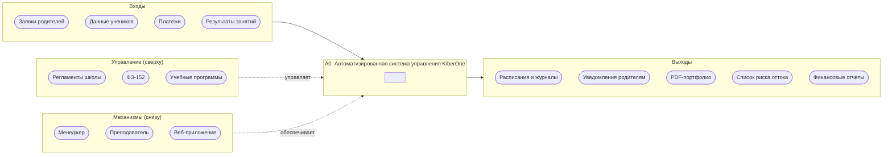
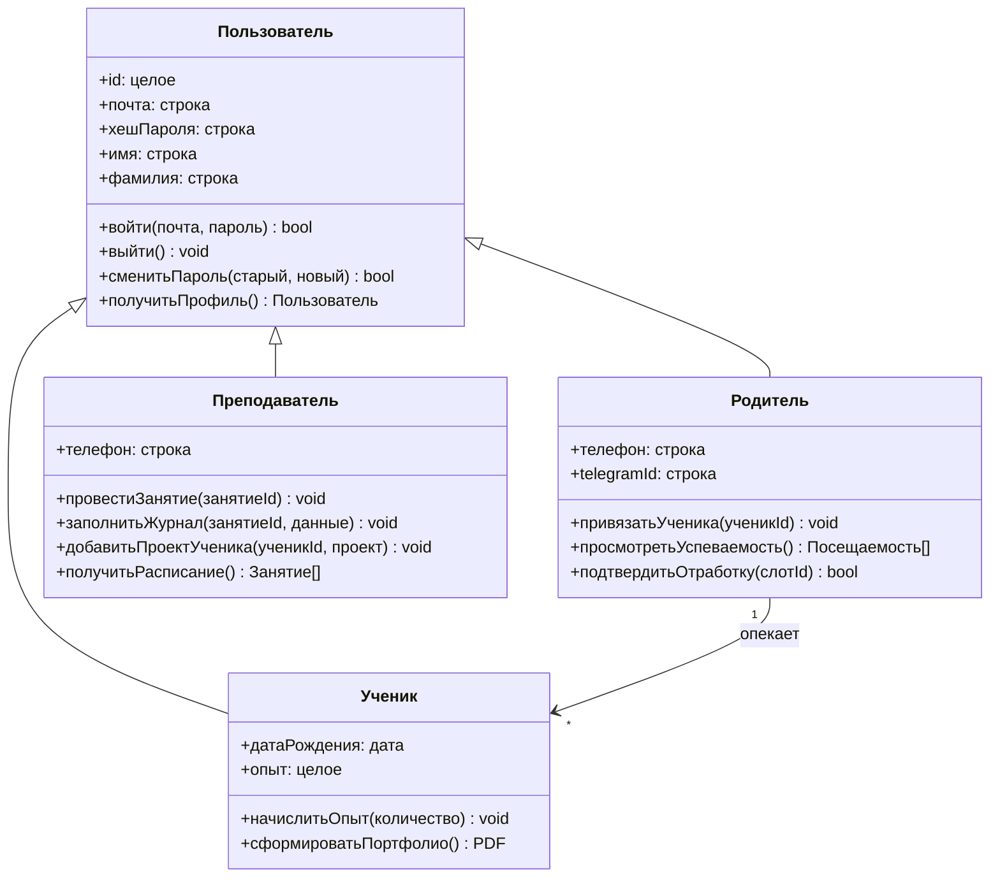
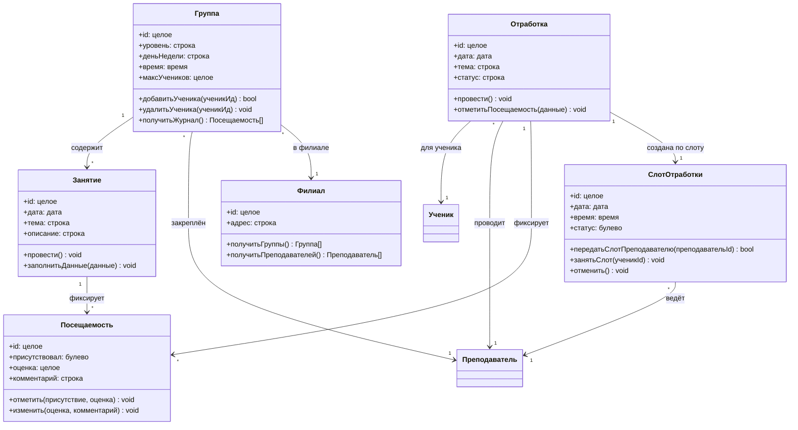
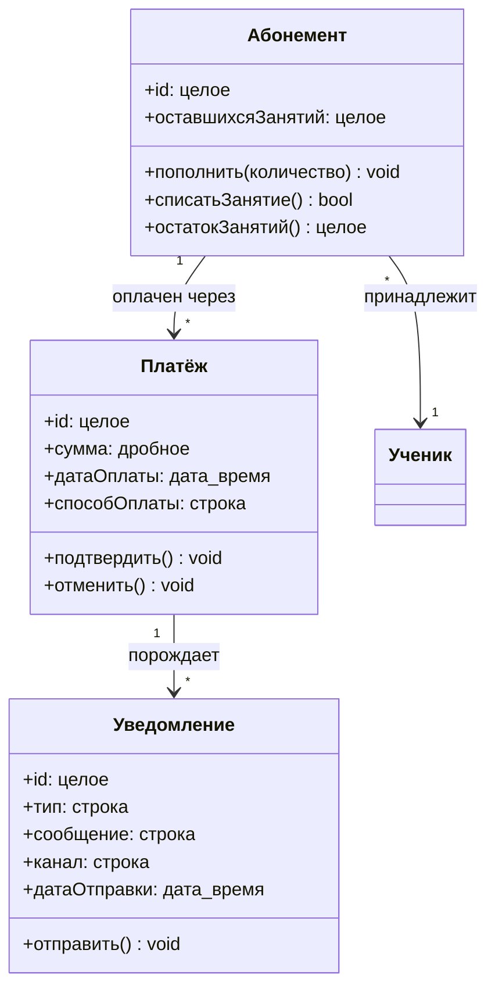
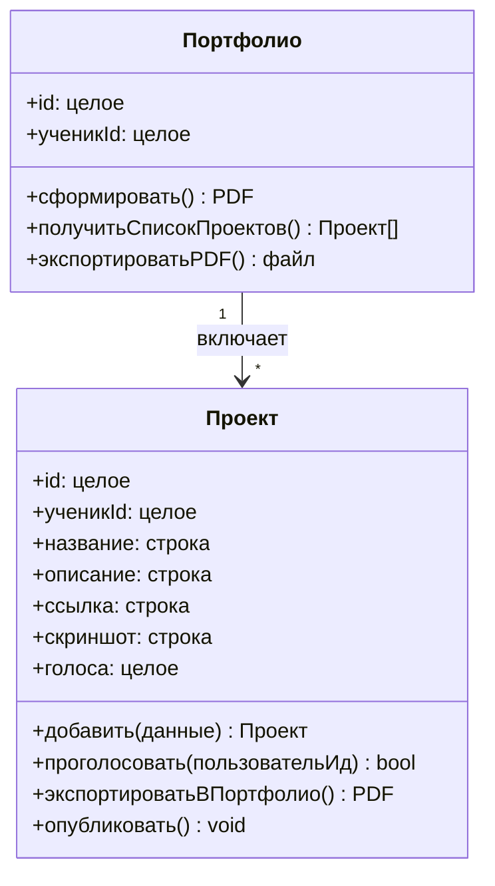
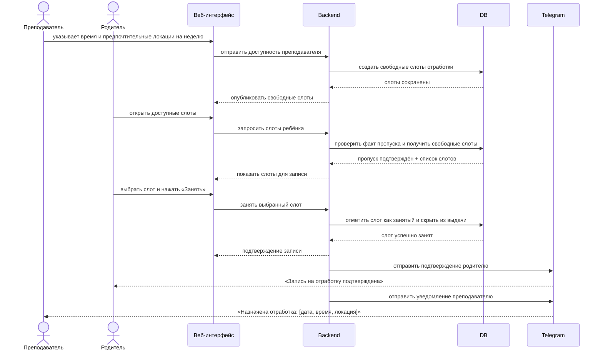
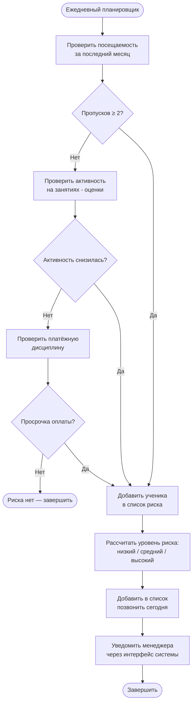

# Диаграммы к разделу 1.4 — Автоматизированная система KiberOne

> Для просмотра диаграмм в VS Code установите расширение **Markdown Preview Mermaid Support**.

---

## Диаграмма 1. IDEF0 — Контекстная диаграмма А0



---

## Диаграмма 2. Варианты использования (Use Case)

```mermaid
graph TD
    Менеджер(["👤 Менеджер"])
    Преподаватель(["👤 Преподаватель"])
    Родитель(["👤 Родитель"])
    Ученик(["👤 Ученик"])

    subgraph System["Система"]
        A[Управление расписанием\nи группами]
        B[Сбор аналитики]
        C[Управление абонементами\nи платежами]
        

        E[Ведение журнала\nпосещаемости и оценок]
        G[Добавление проекта\nученика]

        H[Оценка проектов в ленте]
        I[Запись на отработку]
        J[Отслеживание успеваемости]

        H[Оценка проектов в ленте]
        J[Отслеживание успеваемости]
        M[Генерация портфолио]
    end

    Менеджер --> A
    Менеджер --> B
    Менеджер --> C
    

    Преподаватель --> E
    Преподаватель --> G

    Родитель --> H
    Родитель --> I
    Родитель --> J

    Ученик --> H
    Ученик --> J
    Ученик --> M

    classDef manager fill:#e6f3ff,stroke:#0066cc
    classDef teacher fill:#fff0e6,stroke:#cc6600
    classDef parent fill:#e6ffe6,stroke:#006600
    classDef student fill:#f0e6ff,stroke:#6600cc

    class Менеджер manager
    class Преподаватель teacher
    class Родитель parent
    class Ученик student
```



---

## Диаграмма 3а. Модуль пользователей и ролей



---

## Диаграмма 3б. Модуль учебного процесса




## Диаграмма 3в. Модуль финансов и уведомлений



---

## Диаграмма 3г. Модуль портфолио



---


## Диаграмма 4. Последовательность — Смарт-отработка пропуска



---

## Диаграмма 5. Активность — Антиотток-аналитика



---

## Диаграмма 6. Компоненты — Архитектура системы

```mermaid
flowchart TB
    C[Клиент\nВеб-интерфейс (браузер)]
    S[Сервер приложений\nREST API]
    DB[(PostgreSQL)]
    FS[(Яндекс.Диск)]
    TG[Telegram Bot API]

    C <-->|HTTPS| S
    S <-->|SQL| DB
    S --> FS
    S --> TG
```
