# Диаграммы к разделу 1.4 — Автоматизированная система KiberOne

> Для просмотра диаграмм в VS Code установите расширение **Markdown Preview Mermaid Support**.

---

## Диаграмма 1. IDEF0 — Контекстная диаграмма А0

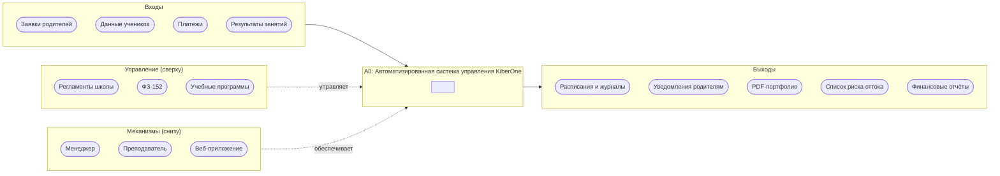

---

## Диаграмма 2. Варианты использования (Use Case)

```mermaid
graph TD
    Менеджер(["👤 Менеджер"])
    Преподаватель(["👤 Преподаватель"])
    Родитель(["👤 Родитель"])
    Ученик(["👤 Ученик"])

    subgraph System["Система"]
        A[Управление расписанием\nи группами]
        B[Сбор аналитики]
        C[Управление абонементами\nи платежами]
        

        E[Ведение журнала\nпосещаемости и оценок]
        G[Добавление проекта\nученика]

        H[Оценка проектов в ленте]
        I[Запись на отработку]
        J[Отслеживание успеваемости]

        H[Оценка проектов в ленте]
        J[Отслеживание успеваемости]
        M[Генерация портфолио]
    end

    Менеджер --> A
    Менеджер --> B
    Менеджер --> C
    

    Преподаватель --> E
    Преподаватель --> G

    Родитель --> H
    Родитель --> I
    Родитель --> J

    Ученик --> H
    Ученик --> J
    Ученик --> M

    classDef manager fill:#e6f3ff,stroke:#0066cc
    classDef teacher fill:#fff0e6,stroke:#cc6600
    classDef parent fill:#e6ffe6,stroke:#006600
    classDef student fill:#f0e6ff,stroke:#6600cc

    class Менеджер manager
    class Преподаватель teacher
    class Родитель parent
    class Ученик student
```

---

## Диаграмма 3а. Модуль пользователей и ролей

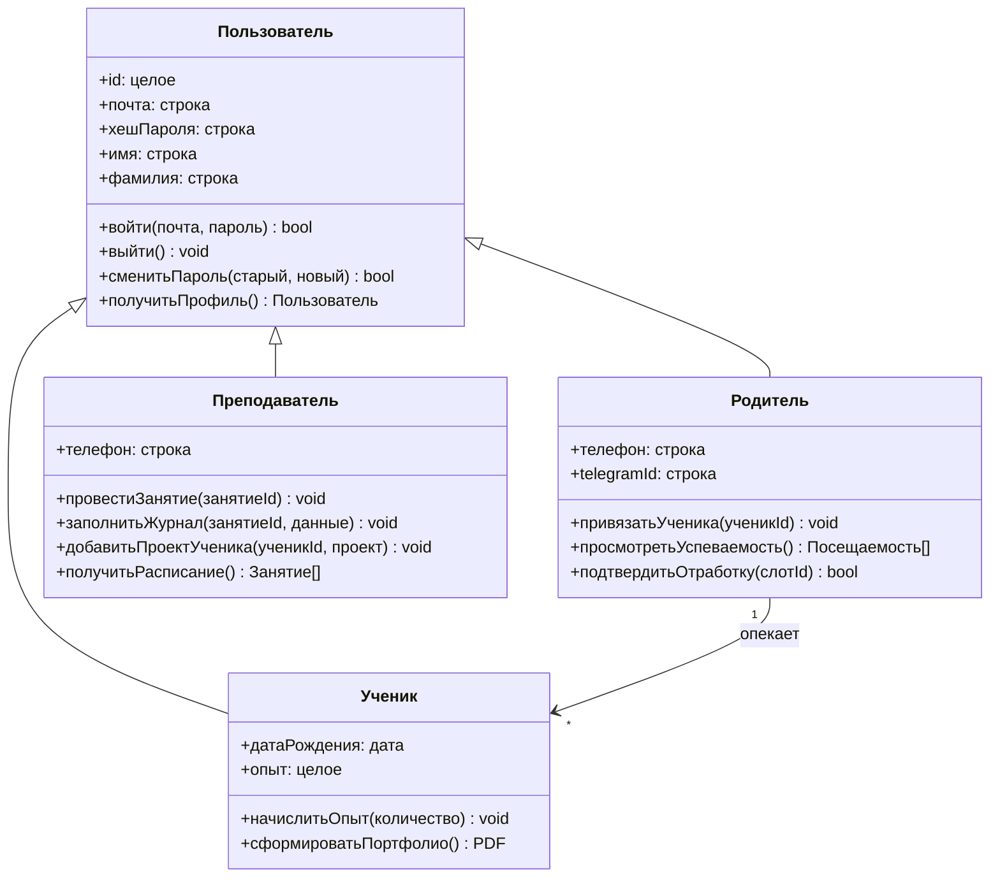

---

## Диаграмма 3б. Модуль учебного процесса

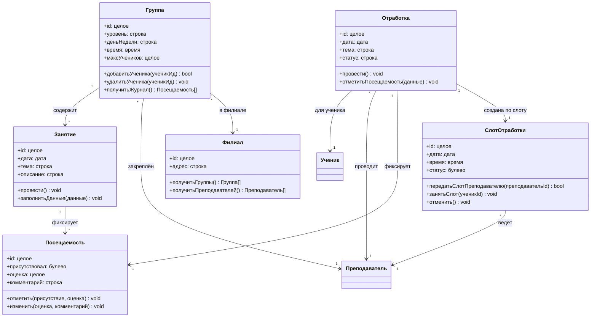

## Диаграмма 3в. Модуль финансов и уведомлений

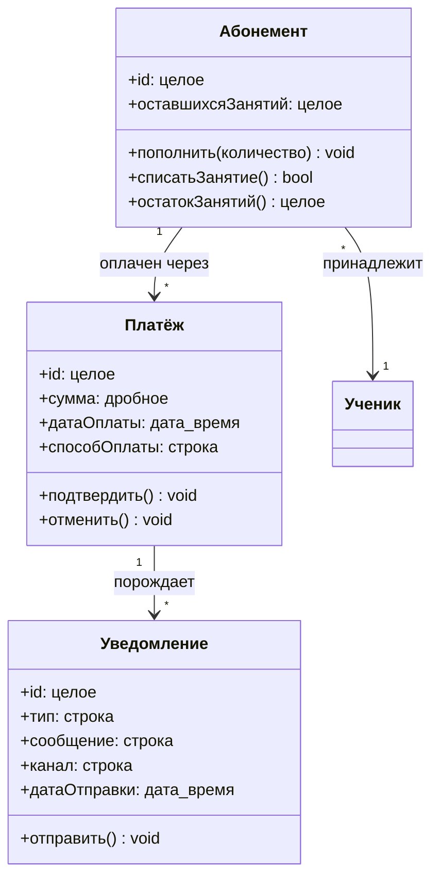

---

## Диаграмма 3г. Модуль портфолио

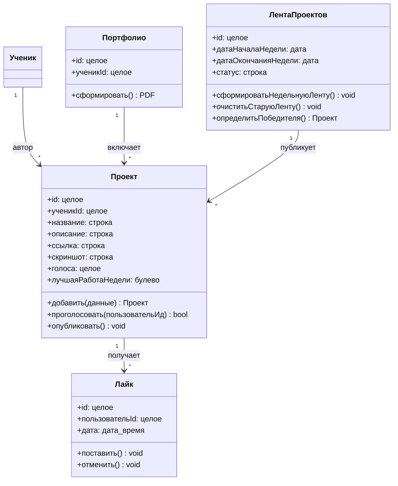

---

## Диаграмма 4. Последовательность — Смарт-отработка пропуска

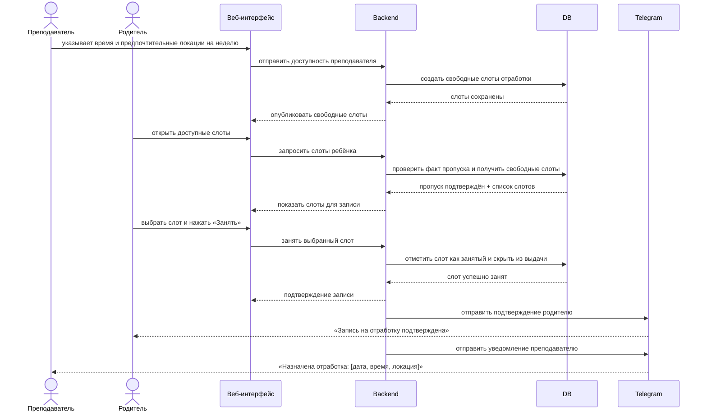

---

## Диаграмма 5. Активность — Антиотток-аналитика

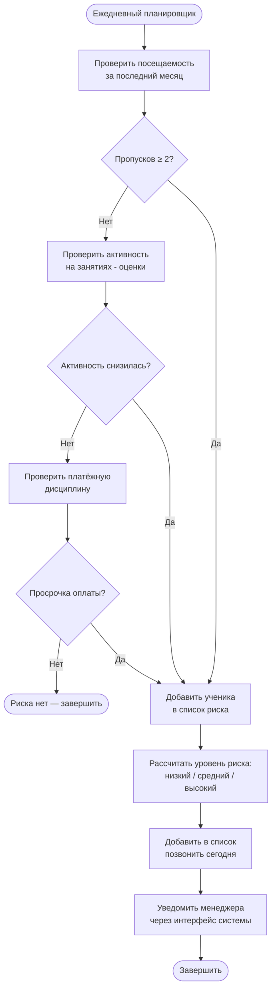

---

## Диаграмма 6. Компоненты — Архитектура системы

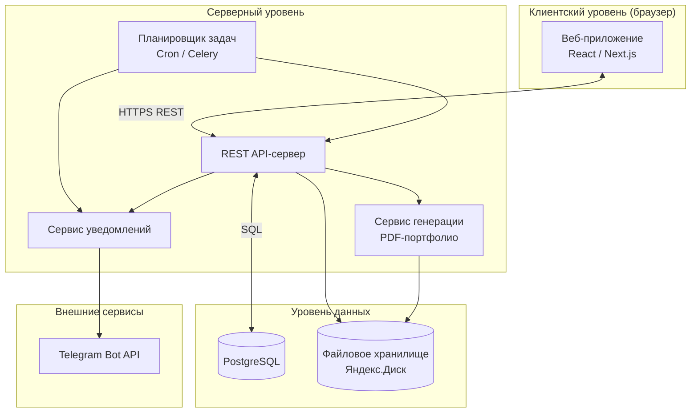

---

## Диаграмма 7а. DFD — Учебный процесс и финансы

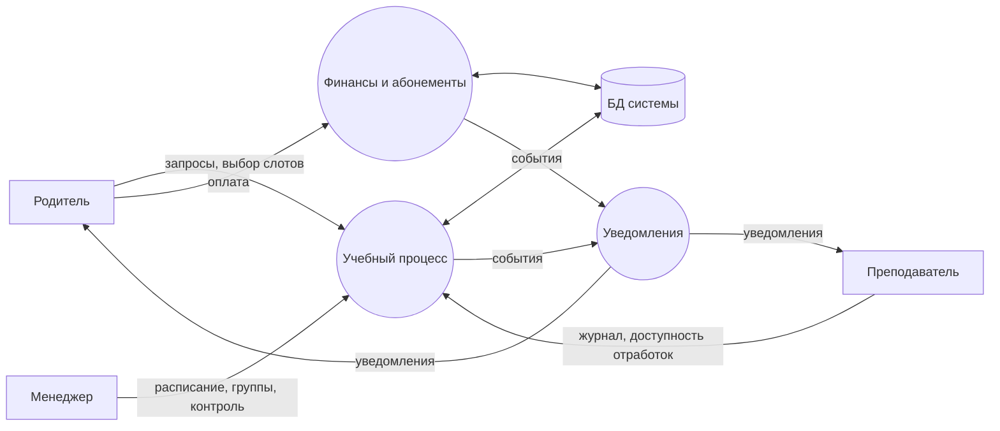

### Диаграмма 7б. DFD — Портфолио и лента проектов

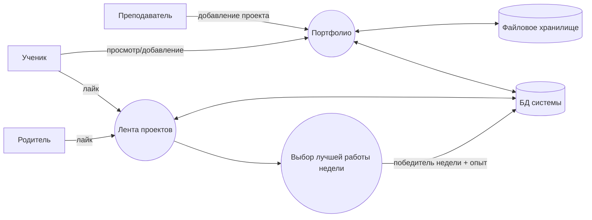

---

## Диаграмма 8. Диаграмма развертывания (Deployment)

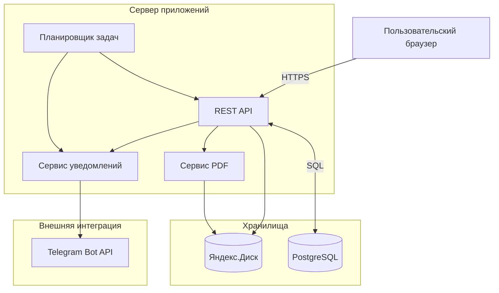

---

## Диаграмма 9. Последовательность — Недельный цикл ленты проектов

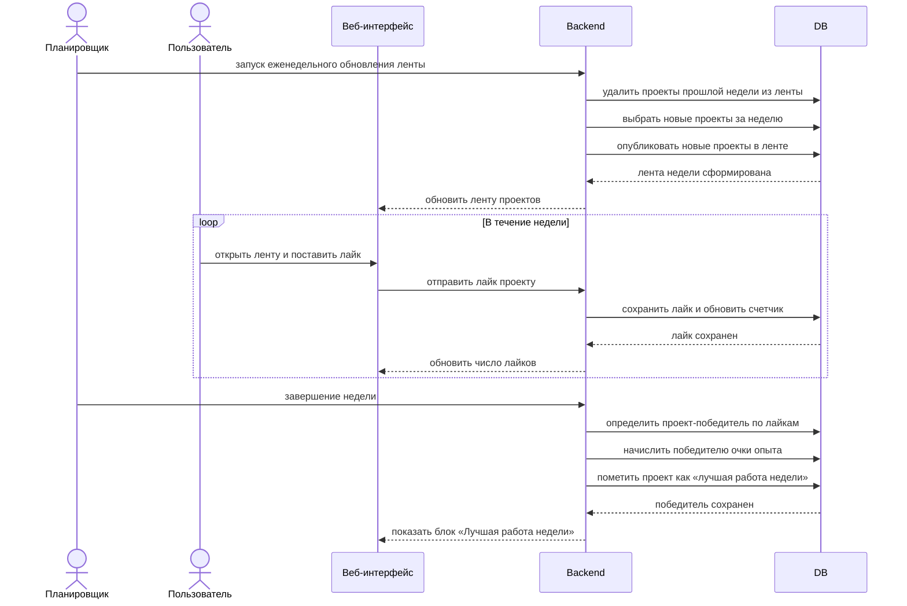

---

## Глава 2. Выбор программных решений и технологии разработки

### 2.1 CASE-средства для проектирования

- **Visual Studio Code** – текстовый редактор для работы с кодом, markdown и диаграммами.
- **Mermaid.js** – создание диаграмм (UML, DFD, IDEF0) в текстовом формате.
- **DBeaver / pgAdmin** – визуальное проектирование и администрирование схемы базы данных PostgreSQL.
- **Docker Desktop** – контейнеризация и локальное развертывание приложения.
- **GitHub** – хранение кода, контроль версий и совместная разработка.

### 2.2 Стек серверной части

- **Python 3.10+** – язык для разработки логики приложения.
- **Django + Django REST Framework** – веб-фреймворк и REST API.
- **PostgreSQL** – реляционная база данных.
- **Celery** – выполнение асинхронных задач (отправка уведомлений, генерация PDF).
- **ReportLab** – генерация PDF-портфолио.

### 2.3 Стек клиентской части

- **React** – библиотека для пользовательского интерфейса.
- **Fetch API** – взаимодействие с серверным API.
- **Bootstrap / CSS** – стилизация интерфейса.
- **Chart.js** – отображение статистики и графиков.

### 2.4 Инфраструктура

- **Nginx** – веб-сервер и обратный прокси.
- **Docker** – контейнеризация приложения для локальной разработки.
- **Git / GitHub** – контроль версий и хранение кода.

### 2.5 Внешние интеграции

- **Telegram Bot API** – отправка уведомлений.
- **PostgreSQL с JSON** – гибкое хранение данных.
- Локальное файловое хранилище для портфолио и документов.

